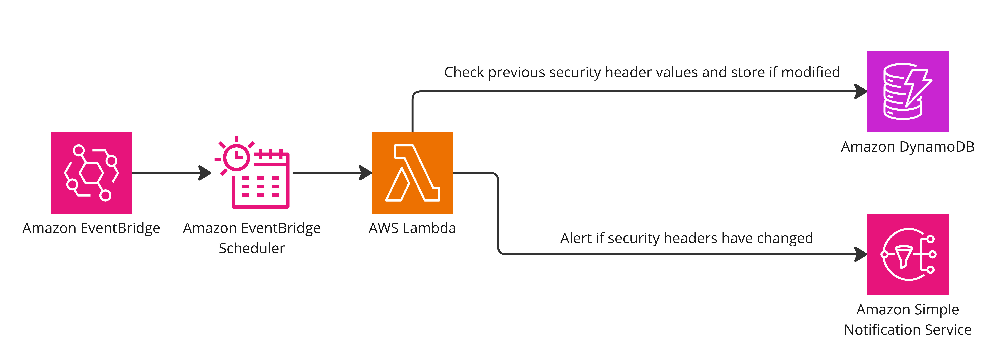

# Aligent Header Change Detection Service

## Overview

Creates a Lambda function that periodically scans security headers and sends the results to SNS.

### Diagram

This service aims to comply with PCI DSS to cover the requirements outlined by section 11.6.1.

**11.6.1**: A change- and tamper-detection mechanism is deployed as follows:
> - To alert personnel to unauthorized modification (including indicators of compromise, changes, additions, and deletions) to the security-impacting HTTP headers and the script contents of payment pages as received by the consumer browser.
> - The mechanism is configured to evaluate the received HTTP headers and payment pages.
> - The mechanism functions are performed as follows:
>   - At least weekly
>     OR
>   - Periodically (at the frequency defined in the entity’s targeted risk analysis, which is performed according to all elements specified in Requirement 12.3.1)

## Default

By default, the following headers are monitored:

- Content-Security-Policy
- Content-Security-Policy-Report-Only
- Reporting-Endpoints
- Strict-Transport-Security
- X-Frame-Options
- X-Content-Type-Options
- Cross-Origin-Opener-Policy
- Cross-Origin-Embedder-Policy
- Cross-Origin-Resource-Policy
- Referrer-Policy
- Permission-Policy
- Cache-Control
- Set-Cookie

## Local development

[NPM link](https://docs.npmjs.com/cli/v7/commands/npm-link) can be used to develop the module locally.
1. Pull this repository locally
2. `cd` into this repository
3. run `npm link`
4. `cd` into the downstream repo (target project, etc) and run `npm link '@aligent/cdk-header-change-detection'`
The downstream repository should now include a symlink to this module. Allowing local changes to be tested before pushing. You may want to update the version notation of the package in the downstream repository's `package.json`.
